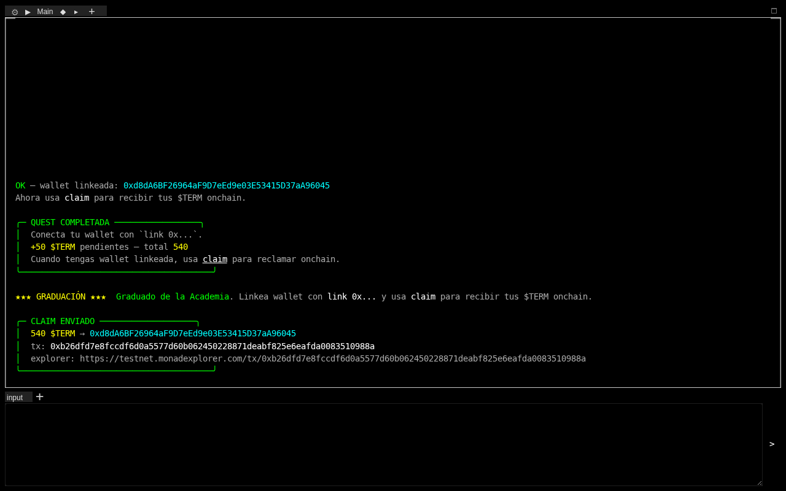
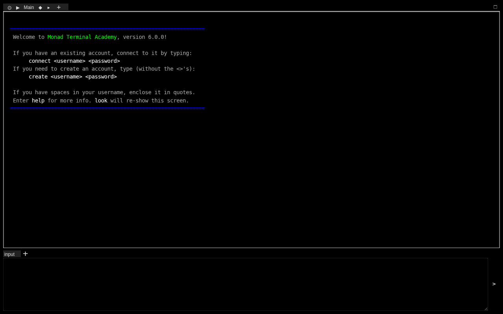
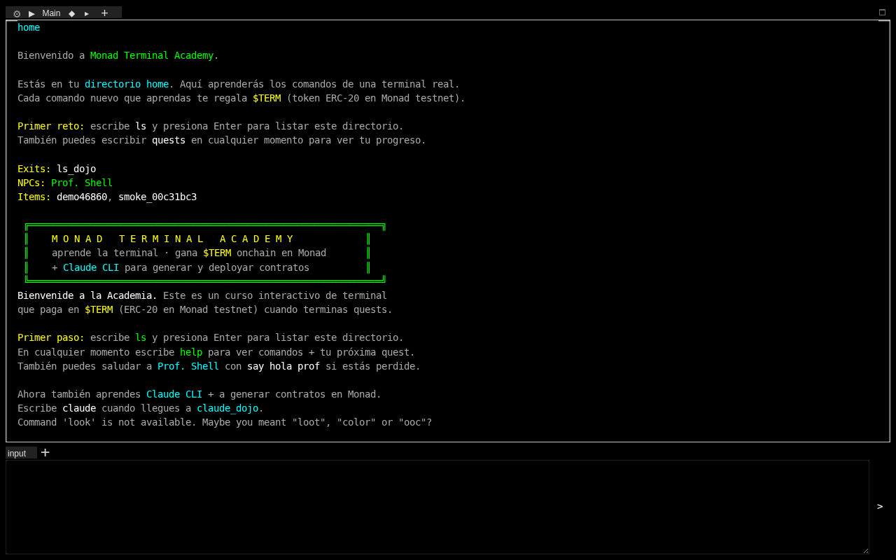
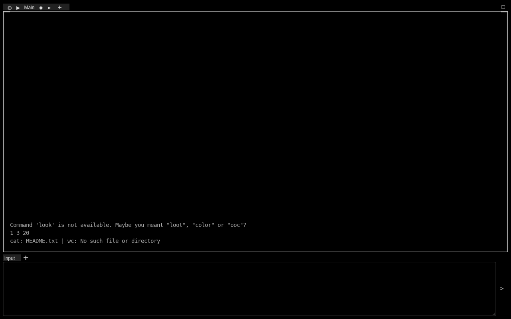
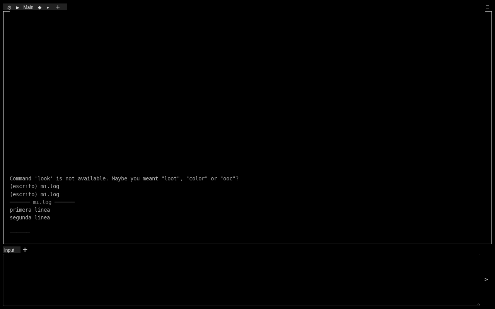
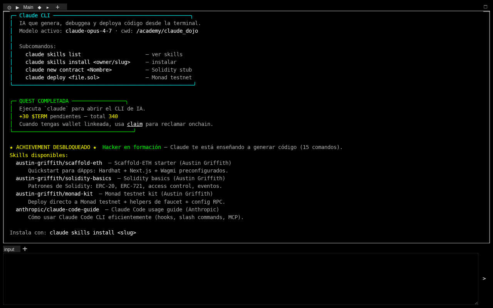
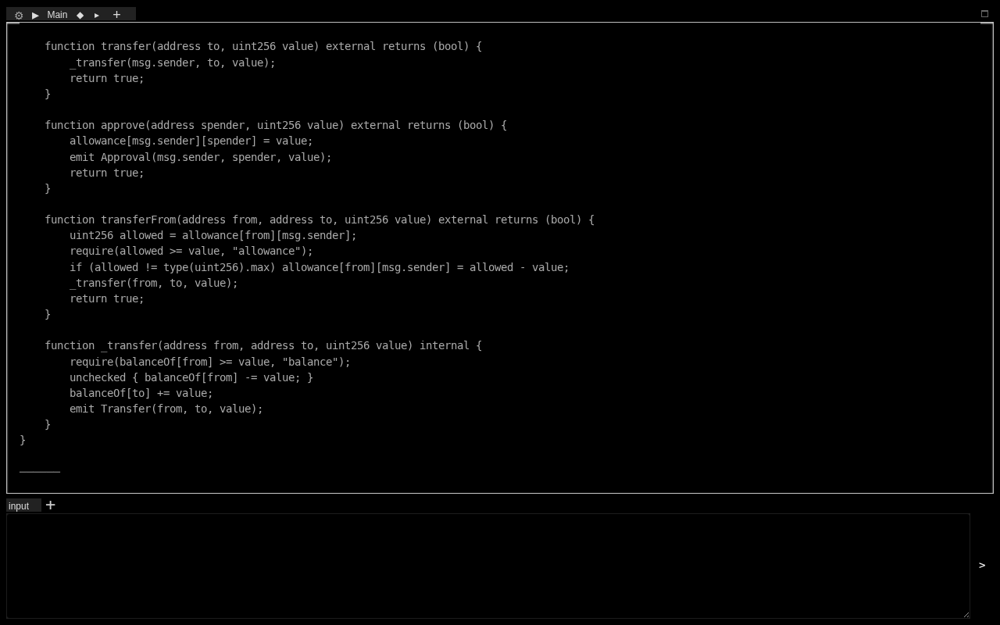
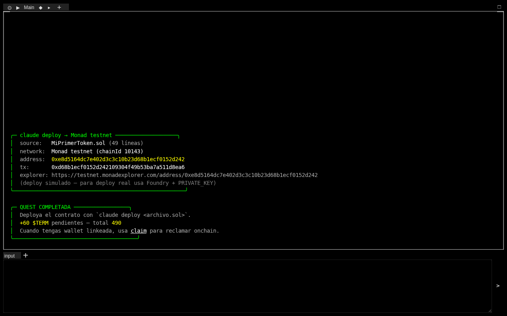

# Monad Terminal Academy

> De `ls` a `claude deploy` en 15 minutos. Aprendé shell + Claude CLI + deploy onchain — todo dentro de un MUD.


MUD educativo onchain construido para el hackathon de Monad. Los jugadores pasan de **no saber qué es `ls`** a **deployar su primer ERC-20 en Monad testnet** en una sola sesión — aprendiendo shell, operadores (`|`, `>`, `>>`), y el uso de **Claude CLI con skills de Austin Griffith** para generar y deployar código. Al completar las 19 quests cobran **540 `$TERM`** onchain.

El diferenciador no es "academia de terminal". Es **academia de terminal + Claude CLI + deploy onchain, todo desde un MUD**.



## ▶ Jugar ahora

- **Webclient público** → https://die-hand-alexandria-joan.trycloudflare.com/webclient/
- **Landing** → https://aka-warning-old-geneva.trycloudflare.com/

> Los URLs son Cloudflare Quick Tunnels (efímeros, sin cuenta). Si caen, ver [Run locally](#run-locally) para relanzar.

## Flujo pedagógico completo

```
ls, pwd, cd → cat → touch, mkdir, grep
  → echo/head/tail/wc/whoami/man/history + pipes (|) + redirects (>, >>)
    → claude skills install austin-griffith/monad-kit
      → claude new contract MiPrimerToken
        → claude deploy MiPrimerToken.sol
          → link <wallet> + claim (tx real en Monad testnet)
```

19 quests, 540 `$TERM`, 9 rooms encadenadas: **home → ls_dojo → cd_dojo → cat_dojo → mkdir_dojo → pipe_dojo → redirect_dojo → final_exam → claude_dojo**.

## Quests

### Shell básico (7)
| Comando | Reward | Qué enseña |
|---|---:|---|
| `ls` | 10 | listar contenido |
| `pwd` | 10 | directorio actual |
| `cd` | 20 | navegar |
| `cat` | 30 | leer archivos |
| `mkdir` | 30 | crear directorio |
| `touch` | 30 | crear archivo vacío |
| `grep` | 50 | buscar texto |

### Shell intermedio + operadores (7)
| Comando | Reward | Qué enseña |
|---|---:|---|
| `echo` | 10 | imprimir texto |
| `whoami` | 10 | usuario actual |
| `head` | 20 | primeras líneas |
| `tail` | 20 | últimas líneas |
| `wc` | 20 | contar líneas/palabras |
| `man` | 20 | leer manual |
| `history` | 30 | comandos previos |

### Claude CLI + onchain (5)
| Comando | Reward | Qué enseña |
|---|---:|---|
| `claude` | 30 | abrir el CLI de IA |
| `claude skills install <slug>` | 40 | instalar skill |
| `claude new contract <Nombre>` | 50 | generar Solidity |
| `claude deploy <archivo.sol>` | 60 | deployar a Monad testnet |
| `link 0x…` | 50 | conectar tu wallet EVM |

## Skills disponibles (in-game)

| Slug | Autor | Descripción |
|---|---|---|
| `austin-griffith/scaffold-eth` | Austin Griffith | Quickstart dApps: Hardhat + Next.js + Wagmi |
| `austin-griffith/solidity-basics` | Austin Griffith | Patrones de Solidity: ERC-20, ERC-721, access control |
| `austin-griffith/monad-kit` | Austin Griffith | Deploy directo a Monad testnet + faucet helpers |
| `anthropic/claude-code-guide` | Anthropic | Cómo usar Claude Code CLI (hooks, slash, MCP) |

El catálogo vive en `AVAILABLE_SKILLS` en `abyss-node/abyss_node/commands/terminal_commands.py`. Editalo para remixear tu propia academia (ver [Para builders](#para-builders--forkeá-esto)).

## Stack

### Game
- **Evennia 6.0** — MUD framework Python/Django
- 9 rooms, 19 comandos, 19 quests, sistema de achievement por milestones
- Webclient HTTP + Telnet raw (port 4100)

### AI CLI (simulado in-game)
- Comando `claude` con subcomandos reales: `skills`, `new contract`, `new token`, `deploy`
- 4 skills de referencia (Austin Griffith + Anthropic)
- Contracts generados con template ERC-20 minimal, guardados al fs virtual del jugador

### Onchain
- **Monad testnet** (chainId `10143`, RPC `testnet-rpc.monad.xyz`)
- ERC-20 minimal custom (sin OpenZeppelin — minimiza gas)
- **web3.py** firma `transfer()` desde hot wallet del juego cuando un jugador hace `claim`

### Infra
- **Cloudflare Quick Tunnels** — público sin cuenta
- **Foundry** para compile + deploy del contrato $TERM

## Onchain receipts

| | |
|---|---|
| Contrato `$TERM` | [`0x6BCC8bA023faD77Fd9c16735fD0DCb030F1b03d8`](https://testnet.monadexplorer.com/address/0x6BCC8bA023faD77Fd9c16735fD0DCb030F1b03d8) |
| Tx claim (540 `$TERM`) | [`0x753b572d…dbddb827b`](https://testnet.monadexplorer.com/tx/0x753b572d4cc3265d082d5da4793bb6d8f29bcfeb355d8b49adc463dabddb827b) |
| Chain ID | `10143` |
| Explorer | https://testnet.monadexplorer.com |

## Screenshots

| Login | Home |
|---|---|
|  |  |

| `pipe_dojo` (<code>&#124;</code>) | `redirect_dojo` (`>`) |
|---|---|
|  |  |

| `claude skills list` | `claude new contract` |
|---|---|
|  |  |

| `claude deploy` (clímax) | `claim` onchain |
|---|---|
|  |  |

## Run locally

```bash
# 1. Clonar y preparar venv
cd monadmty
python3.13 -m venv .venv
source .venv/bin/activate
pip install -r requirements.txt    # evennia, web3, python-dotenv, playwright…

# 2. Arrancar servidor Evennia
cd abyss-node/abyss_node
evennia start

# 3. (opcional) Exponer público con Cloudflare Quick Tunnels
nohup ~/.local/bin/cloudflared tunnel --url http://localhost:4101 > /tmp/cf-http.log 2>&1 & disown
nohup ~/.local/bin/cloudflared tunnel --url http://localhost:4103 > /tmp/cf-ws.log 2>&1 & disown
# Tras ~5s, las URLs aparecen en los logs. Actualizar WEBSOCKET_CLIENT_URL en
# server/conf/settings.py con la URL del WS y reload:
evennia reload
```

Jugá via telnet (`telnet localhost 4100`) o webclient (`http://localhost:4101/webclient/`). Credenciales admin: `admin` / `monadtestnet123`.

## Para builders — Forkeá esto

Monad Terminal Academy está diseñado como **template** para onboardear dev-newbies a la chain que elijas. El flujo de Claude CLI in-game es **100% remixeable**:

1. Editá `AVAILABLE_SKILLS` en `abyss-node/abyss_node/commands/terminal_commands.py` con tus propios skills (owner/slug + autor + descripción).
2. Editá `_CONTRACT_TEMPLATE` en el mismo archivo para cambiar qué genera `claude new contract` (ERC-721? vault? voting?).
3. Cambiá la red en `deploy/.env` (`MONAD_RPC_URL`, `MONAD_CHAIN_ID`) para apuntar a tu L1/L2.
4. Redeployá el contrato reward (`contracts/src/MonadAbyss.sol` — es un ERC-20 minimal) con tu token.
5. Personalizá rooms/quests en `world/zones/terminal_academy.py` y `QUESTS` en `terminal_commands.py`.

Resultado: **tu propia "X Chain Academy"** — onboarding gamificado con pay-to-learn onchain en la cadena que tu hackathon esté incubando.

## Documentación

- [`PRD.md`](PRD.md) — producto y sesiones de trabajo paralelas
- [`docs/pitch/pitch.md`](docs/pitch/pitch.md) — slide deck de 1 página
- [`docs/pitch/demo-script.md`](docs/pitch/demo-script.md) — guión de demo de 2 min
- Memoria del workspace en `~/.claude/projects/.../memory/` (runbook, assets, contexto)

## Créditos

- Base: [`abyss-node`](./abyss-node/) — MUD cyberpunk Evennia (proyecto original del que pivotamos)
- Framework: [Evennia](https://www.evennia.com) · [Foundry](https://getfoundry.sh) · [web3.py](https://web3py.readthedocs.io)
- AI CLI: inspirado en [Claude Code](https://claude.com/claude-code) y los skills de [Austin Griffith](https://github.com/austintgriffith)
- Chain: [Monad](https://monad.xyz) testnet

---

Hecho con terminal, Claude, y bloques de Monad.
